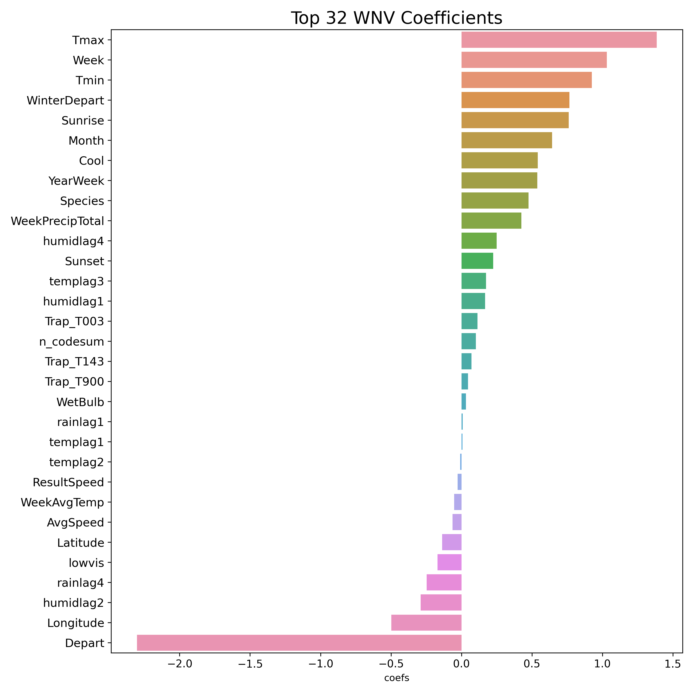
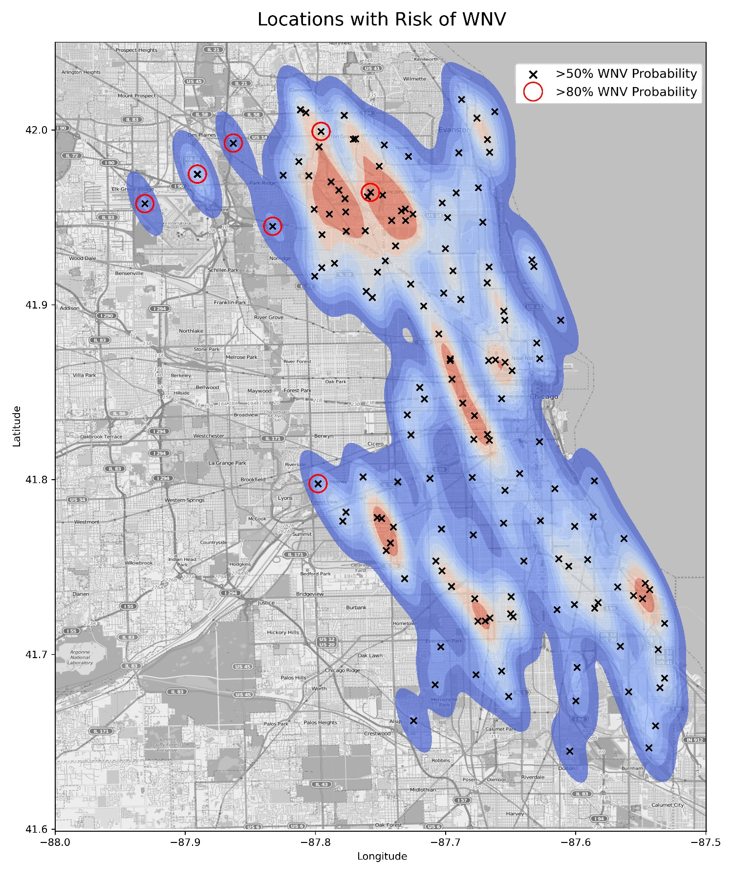

# Project 4: West Nile Virus Prediction

## Introduction

The West Nile Virus (WNV) has been a serious problem for the United States since 1999. The [CDC](https://www.cdc.gov/westnile/index.html) has acknowledged it as the leading cause of mosquito-borne disease in the continental United States. However, there are no vaccines to prevent or medications to treat WNV in people -- according to the CDC, 1 in 5 people who are infected develop a fever and other symptoms, while 1 out of 150 infected people develop a serious, sometimes fatal, illness.

In Illinois, [West Nile virus was first identified in September 2001](https://www.dph.illinois.gov/topics-services/diseases-and-conditions/west-nile-virus) when laboratory tests confirmed its presence in two dead crows found in the Chicago area. The following year, the state's first human cases and deaths from West Nile disease were recorded and all but two of the state's 102 counties eventually reported a positive human, bird, mosquito or horse. By the end of 2002, Illinois had counted more human cases (884) and deaths (64) than any other state in the United States.

Since then, Illinois and more specifically Chicago, has continued to suffer from multiple outbreaks of the West Nile Virus. From 2005 to 2016, a total of 1,371 human WNV cases were [reported](https://journals.plos.org/plosone/article?id=10.1371/journal.pone.0227160) within Illinois. Out of these total reported cases, 906 cases (66%) were from the Chicago region (Cook and DuPage Counties). 

With this in mind, <b>our project is aimed at predicting outbreaks of the West Nile Virus</b>. This will help the City of Chicago and Chicago Department of Public Health (CDPH) more efficiently and effectively allocate resources towards preventing transmission of this potentially deadly virus. Specifically, our model will use a combination of weather, time and location features to predict the presence of WNV within mosquito traps set up throughout Chicago. 

## Executive Summary

Our top performing model was a Logistic Regression model (Lasso Regularization with an $\alpha$ of 1.0), which achieved an AUC scores of <b>0.787</b> on Kaggle. This placed us among the top 15% of all teams that participated within the competition. To achieve these results, we used a range of feature engineering, selection and oversampling techniques including Synthetic Minority Over-Sampling (SMOTE).
Some of our best predictors were temperature-related features, such as `Tmax` and `WinterDepart`. Time-based features like `Week` and `Month` were also crucial in helping our model to identify the presence of the West Nile Virus. We also saw other weather related variables like `humidlag4` play a role in our model. Location features like `Longitude` and trap location also played a minor role here.

<table class="dcf-table dcf-table-responsive dcf-table-bordered dcf-table-striped dcf-w-100%">
	<caption>Model Results (Sorted by Test AUC)</caption>
	<thead>
		<tr>
			<th class="dcf-txt-center" data-label="Model" scope="col">Model</th>
			<th class="dcf-txt-center" data-label="Train AUC" scope="col">Train AUC</th>
			<th class="dcf-txt-center" data-label="Test AUC" scope="col">Test AUC</th>
			<th class="dcf-txt-center" data-label="Precision" scope="col">Precision</th>
			<th class="dcf-txt-center" data-label="Specificity" scope="col">Specificity</th>
			<th class="dcf-txt-center" data-label="Recall" scope="col">Recall</th>
			<th class="dcf-txt-center" data-label="F-score" scope="col">F-score</th>
		</tr>
	</thead>
	<tbody>
		<tr>
			<td class="dcf-txt-center" data-label="Model">Logistic Regression</td>
			<td class="dcf-txt-center" data-label="Train AUC">0.858627</td>
			<td class="dcf-txt-center" data-label="Test AUC">0.823617</td>
			<td class="dcf-txt-center" data-label="Precision">0.140553</td>
			<td class="dcf-txt-center" data-label="Specificity">0.750251</td>
			<td class="dcf-txt-center" data-label="Recall">0.739394</td>
			<td class="dcf-txt-center" data-label="F-score">0.236205</td>
		</tr>
		<tr>
			<td class="dcf-txt-center" data-label="Model">Ada Boosting</td>
			<td class="dcf-txt-center" data-label="Train AUC">0.961605</td>
			<td class="dcf-txt-center" data-label="Test AUC">0.808654</td>
			<td class="dcf-txt-center" data-label="Precision">0.157986</td>
			<td class="dcf-txt-center" data-label="Specificity">0.837630</td>
			<td class="dcf-txt-center" data-label="Recall">0.551515</td>
			<td class="dcf-txt-center" data-label="F-score">0.245614</td>
		</tr>
		<tr>
			<td class="dcf-txt-center" data-label="Model">Extra Trees</td>
			<td class="dcf-txt-center" data-label="Train AUC">0.974448</td>
			<td class="dcf-txt-center" data-label="Test AUC">0.807757</td>
			<td class="dcf-txt-center" data-label="Precision">0.148900</td>
			<td class="dcf-txt-center" data-label="Specificity">0.831604</td>
			<td class="dcf-txt-center" data-label="Recall">0.533333</td>
			<td class="dcf-txt-center" data-label="F-score">0.232804</td>
		</tr>
		<tr>
			<td class="dcf-txt-center" data-label="Model">Gradient Boosting</td>
			<td class="dcf-txt-center" data-label="Train AUC">0.997995</td>
			<td class="dcf-txt-center" data-label="Test AUC">0.801529</td>
			<td class="dcf-txt-center" data-label="Precision">0.232673</td>
			<td class="dcf-txt-center" data-label="Specificity">0.948108</td>
			<td class="dcf-txt-center" data-label="Recall">0.284848</td>
			<td class="dcf-txt-center" data-label="F-score">0.256131</td>
		</tr>
		<tr>
			<td class="dcf-txt-center" data-label="Model">Random Forest</td>
			<td class="dcf-txt-center" data-label="Train AUC">0.992065</td>
			<td class="dcf-txt-center" data-label="Test AUC">0.797336</td>
			<td class="dcf-txt-center" data-label="Precision">0.177616</td>
			<td class="dcf-txt-center" data-label="Specificity">0.886843</td>
			<td class="dcf-txt-center" data-label="Recall">0.442424</td>
			<td class="dcf-txt-center" data-label="F-score">0.253472</td>
		</tr>
		<tr>
			<td class="dcf-txt-center" data-label="Model">Support Vector Machine</td>
			<td class="dcf-txt-center" data-label="Train AUC">0.938088</td>
			<td class="dcf-txt-center" data-label="Test AUC">0.778879</td>
			<td class="dcf-txt-center" data-label="Precision">0.140950</td>
			<td class="dcf-txt-center" data-label="Specificity">0.806160</td>
			<td class="dcf-txt-center" data-label="Recall">0.575758</td>
			<td class="dcf-txt-center" data-label="F-score">0.226460</td>
		</tr>
		<tr>
			<td class="dcf-txt-center" data-label="Model">Decision Tree</td>
			<td class="dcf-txt-center" data-label="Train AUC">0.989197</td>
			<td class="dcf-txt-center" data-label="Test AUC">0.724557</td>
			<td class="dcf-txt-center" data-label="Precision">0.157360</td>
			<td class="dcf-txt-center" data-label="Specificity">0.888852</td>
			<td class="dcf-txt-center" data-label="Recall">0.375758</td>
			<td class="dcf-txt-center" data-label="F-score">0.221825</td>
		</tr>
	</tbody>
</table>

We also chose the Logisitc Regression model due to it's high recall score. Given that the West Nile Virus can lead to human death, it's imperative for false negatives to be minimized and for true positives to be maximized. Our Logistic Regression model has by far the best recall score out of all the other models (0.74) though it has weak precision and specificity scores, but we believe that this is a fair trade off as 
incorrectly predicting the lack of WNV can increase chances of an outbreak, leading to potential snowball effects on hospitalization rates and the economy. 

## Recommendations

Our model has shown that certain areas are particularly 'dense' in terms of WNV-positive pools and pool proximity. In conjunction to this, our model also highlighted several spots with a more than 80% probability of a WNV outbreak. We believe that these areas should be an immediate 
focus for mosquito control efforts. These areas have been highlighted in red:

- ORD Terminal 5, O'Hare International Airport, Chicago
- Ohare Court, Bensenville
- 6500 North Oak Park Avenue, Chicago
- 4600 Milwaukee Avenue, Chicago
- 3600 North Pittsburgh Avenue, Chicago
- 5200 South Nordica Avenue, Chicago
- 9100 West Higgins Road, Rosemont

We recommend using the following methods to deal with areas with a high WNV risk:

<b>Automation with drones</b>

Drones can serve multiple purposes when it comes to combatting WNV: 

1. They can collect aerial images that can be used analyzed to identify and map breeding sites—such as cisterns, pots and buckets, 
old tires and flower pots. These images can be aggregated into accurate maps to support targeted application of larvicides 
(insecticides that specifically target the larval stage of an insect) at these potential breeding sites.
2. Once larval habitats are identified, drones can be equipped to carry and apply larvicides and/or adulticides to small targeted areas. 
These drones can also be fitted with a global positioning system (GPS) that can track flight patterns in conjunction with insecticide application. 
An operator can remotely pilot the drone or, in some cases, autopilot programs may be available for pre-programmed flights. Drones can be 
useful to target specific areas with larvicides or adulticides, as an alternative to truck-mounted applications that may require a 
high degree of drift of droplets in order to reach a target area in remote locations.

In summary, drones could be more environmentally friendly than doing the same spraying procedure on foot, and are likely to be a lot more accurate due to the ability 
to spray from a fully-vertical angle.

<b>Adoption of best practices</b>

The city of Chicago can aim to reduce spraying target areas by adopting guidelines from tropical countries like [Singapore](https://www.nea.gov.sg/dengue-zika/stop-dengue) that have proven to be successfully 
in combatting mosquito-borne viruses. For example, this could involve active on-the-ground checks of homes and premises for mosquito habitats, where public officers 
provide advice on steps you can take to prevent mosquito breeding and impose penalties if premises are found with mosquito breeding.

Through automation and more efficient mosquito vector control processes, we can reduce the cost of spraying, 
enabling the city of Chicago to save human lives and prevent further outbreaks of the West Nile Virus.